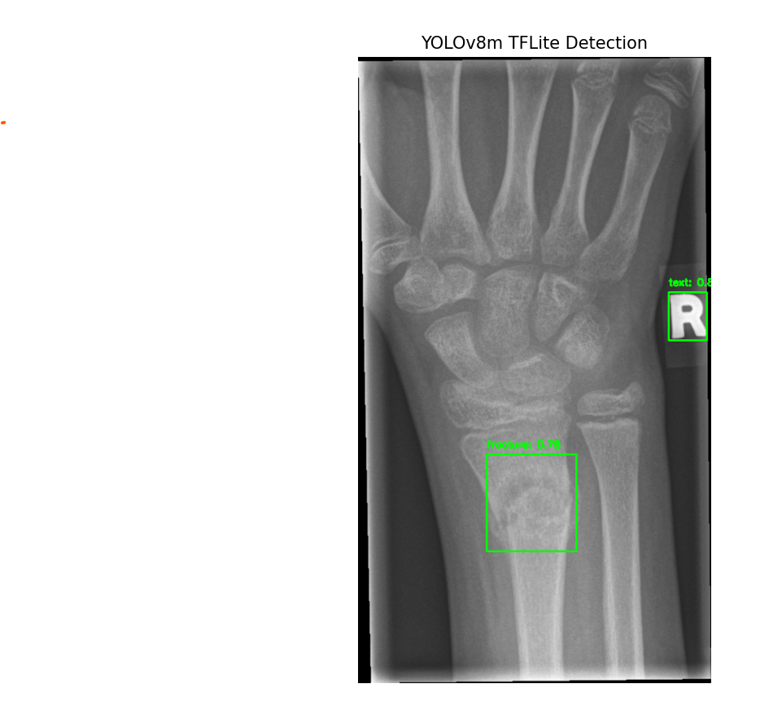

# Fracture Detection using YOLOv8n

## Dataset  
**Dataset:** [GRAZPEDWRI-DX Dataset (Split by Ju)](https://ruiyangju.github.io/GRAZPEDWRI-DX_JU/)  
The dataset consists of pediatric hand X-rays, annotated with detailed fracture locations.

---

## Run Code
```bash
python fracture_detection.py
```

---

## Training Config

| **Parameter** | **Used Value**              | **Description**                                                    |
| ------------- | --------------------------- | ------------------------------------------------------------------ |
| `model`       | `last.pt`                   | Continue training from the most recent checkpoint                  |
| `data`        | `meta.yaml` (GRAZPEDWRI-DX) | Configuration file containing dataset paths and YOLO-format labels |
| `epochs`      | 70                          | Total training iterations (early stopped at epoch 70)              |
| `batch`       | 32                          | Number of samples per training batch                               |
| `imgsz`       | 640                         | Input image size (640×640 pixels)                                  |
| `device`      | `cpu`                       | Training performed on CPU                                          |
| `optimizer`   | `SGD`                       | Optimization algorithm: Stochastic Gradient Descent                |
| `lr0`         | 0.005                       | Initial learning rate                                              |
| `pretrained`  | `False`                     | Pretrained weights not used                                        |
| `resume`      | `True`                      | Resume training from previous checkpoint                           |
| `save`        | `True`                      | Save model weights and results after each epoch                    |
| `val`         | `True`                      | Evaluate model performance on validation set after each epoch      |
| `patience`    | 100                         | Early stopping patience threshold (not triggered within 70 epochs) |
| `workers`     | 2                           | Number of parallel data loading workers                            |


---

##  Training Environment
- **CPU:** Intel Core i3-1005G1  
- **RAM:** 8GB  
- **OS:** Windows 11  
- **Lib:**  
  - `ultralytics==8.0.x`  
  - `torch==2.x`  
  - `opencv`  
  - `numpy`  

---

##  Detailed training configuration
- **Epochs:** 100 (stopped at epoch 70 do early stopping)  
- **Batch size:** 32  
- **Learning rate:** 0.005  
- **Optimizer:** SGD  
- **Augmentation:** RandAugment, FlipLR, Scale, Translate  

---
## Predict

---
## Result 
 


