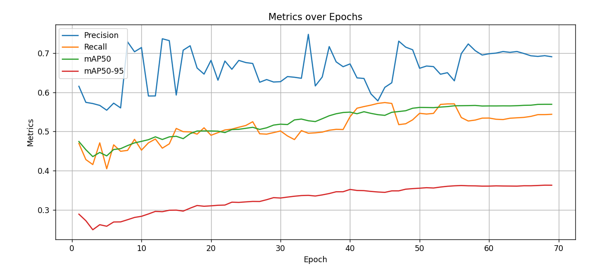

# Fracture Detection using YOLOv8n

## Dataset  
**Dataset:** [GRAZPEDWRI-DX Dataset (Split by Ju)](https://ruiyangju.github.io/GRAZPEDWRI-DX_JU/)  
Bộ dữ liệu bao gồm các ảnh X-quang tay trẻ em, được chú thích chi tiết vị trí gãy xương (fracture).  

---

## Run Code
```bash
python fracture_detection.py
```

---

## Training Config

| **Tham số** | **Giá trị sử dụng** | **Mô tả** |
|--------------|----------------------|------------|
| `model` | `last.pt` | Tiếp tục huấn luyện từ checkpoint gần nhất |
| `data` | `meta.yaml` (GRAZPEDWRI-DX) | File cấu hình chứa đường dẫn tập ảnh và nhãn (YOLO format) |
| `epochs` | 70 | Tổng số vòng lặp huấn luyện (training dừng sớm ở epoch 70) |
| `batch` | 32 | Kích thước mỗi batch dữ liệu |
| `imgsz` | 640 | Kích thước ảnh đầu vào (640×640 pixels) |
| `device` | `cpu` | Huấn luyện trên CPU |
| `optimizer` | `SGD` | Bộ tối ưu hóa Stochastic Gradient Descent |
| `lr0` | 0.005 | Learning rate ban đầu |
| `pretrained` | `False` | Không sử dụng trọng số pretrained |
| `resume` | `True` | Huấn luyện tiếp từ checkpoint trước đó |
| `save` | `True` | Lưu kết quả và trọng số mô hình sau mỗi epoch |
| `val` | `True` | Đánh giá mô hình trên tập validation mỗi epoch |
| `patience` | 100 | Ngưỡng dừng sớm (early stopping) — không kích hoạt trong 70 epoch |
| `workers` | 2 | Số luồng xử lý dữ liệu song song |

---

##  Training Environment
- **CPU:** Intel Core i3-1005G1  
- **RAM:** 8GB  
- **OS:** Windows 11  
- **Thư viện:**  
  - `ultralytics==8.0.x`  
  - `torch==2.x`  
  - `opencv`  
  - `numpy`  

---

##  Detailed training configuration
- **Epochs:** 100 (training dừng tại epoch 70 do early stopping)  
- **Batch size:** 32  
- **Learning rate:** 0.005  
- **Optimizer:** SGD  
- **Augmentation:** RandAugment, FlipLR, Scale, Translate  

---

## Result 
 
```markdown


